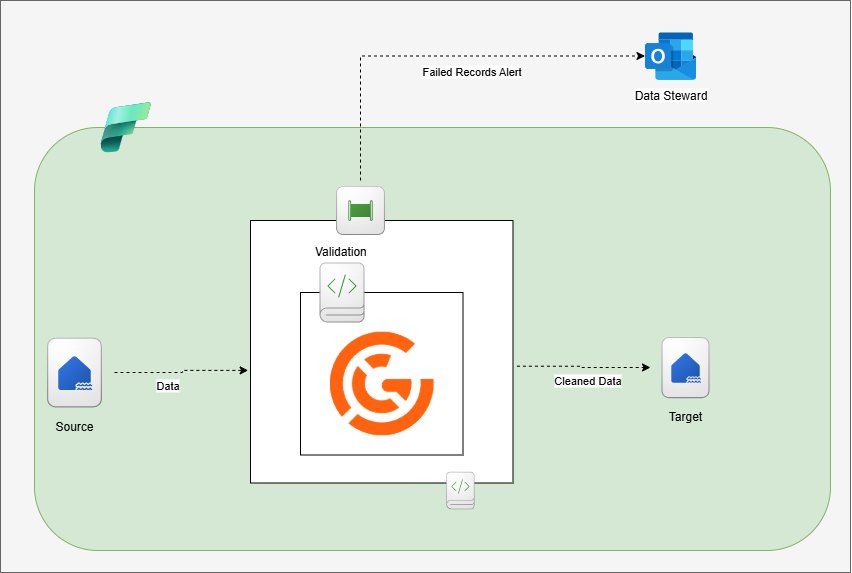

# Data Validation with Great Expectation

You owe your dashboard users and analysts quality data, so you should always validate your data. In this project, I have used **Great Expectations (GX)** (pretty much the industry standard) within a Microsoft Fabric pipeline to handle data validation and quality checks. The goal is to ensure data remains accurate, consistent, and trustworthy before moving further down the pipeline. By integrating GX, the pipeline can automatically test incoming data against predefined rules (expectation), catch errors early, monitor data health and provide clear reports.

## Prerequisite

- Azure account
- Fabrics setup. For the free trial follow [this](https://www.youtube.com/watch?v=RHV7jZqc_tE)
- Microsoft tenant/ work email.
- `PySpark`
- Great Expectation (GX) `v1.6.2`
- `SMTP`

## Overview

I have set up a pipeline to run data quality checks on shipment data, making sure the information is accurate and reliable. This included a GX (Great Expectations) environment and configured data contracts to validate the key columns based on logistics domain knowledge. The pipeline will test and validate incoming batch data, move the clean data to the next layer, and trigger alerts to notify stakeholders if any issues come up during validation.

### Data

Dataset used is stored in a Fabric lakehouse and it holds shipment information, but some of the records have issues like invalid package weights, quantities, tracking numbers, and couriers that can’t be identified.

### GX Workflow

To implement the GX workflow, I recommend getting started with the GX Core components and primary workflows [here](https://docs.greatexpectations.io/docs/core/introduction/gx_overview). It is an ideal place to start before exploring more advanced topics found in the GX Core documentation.

Source:[GX](https://docs.greatexpectations.io/docs/core/introduction/gx_overview)

During the implementation, expectations are configured based on domain knowledge of the shipment data. This had four expectations set up and added to an expectation suite.

Implementation of the setup can be found in the [Validation_NB](https://github.com/adekolaolat/validation-great-expectation-fabric/blob/main/notebooks/Process_Data_NB.ipynb) notebook.

### Validation failure alert

The validation process returns a JSON object, which is passed out as an exit value. This JSON can be used as a configuration in a pipeline to trigger notifications (e.g., via Teams or Outlook using an Office 365 activity) to alert the data steward if validation issues occur.

Since this project doesn’t have an Office 365 subscription, I set up an alternative solution using a personal SMTP server to send notifications to Outlook.

- Creating a pipeline that runs the [Process_Data_NB](https://github.com/adekolaolat/validation-great-expectation-fabric/blob/main/notebooks/Process_Data_NB.ipynb) notebook will process the data and send the alert.

- The function that handles sending the notification is in the [UtilityFunc](https://github.com/adekolaolat/validation-great-expectation-fabric/blob/main/notebooks/UtilityFunc.ipynb) Notebook.

- Email configurations are stored in notify.json, located in `Files/notification/notify.json` in the lakehouse.

- I used a Gmail SMTP configuration for testing.

To enable this, you’ll need to create an App Password in Gmail/Outlook (instead of using your regular password) and configure it for the application. [Gmail](https://support.google.com/accounts/answer/185833?hl=en), [Outlook](https://support.microsoft.com/en-gb/account-billing/how-to-get-and-use-app-passwords-5896ed9b-4263-e681-128a-a6f2979a7944)

Also, use a corresponding SMTP configuration in the `sendNotification()` function if using Outlook.

## Outcome

- **A sample alert that includes a report showing where validation failures occurred, along with the necessary details to investigate the issues.**  

- **Bad records are dropped before promoting data to a higher quality layer (Silver/Gold) if any of these checks fail.**

  - Tracking ID for any shipment is valid (includes length validation).
  - No Carrier field is blank.
  - Weights and Quantity of Packages is valid i.e positive